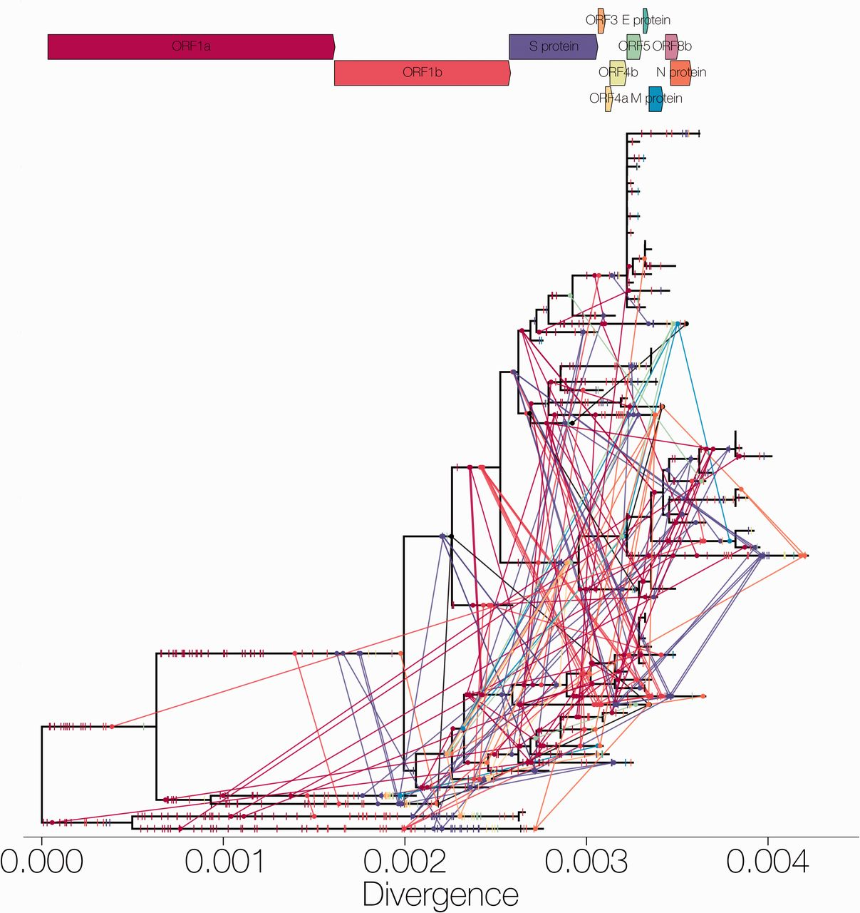
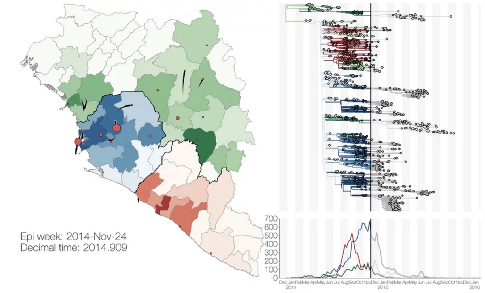

# [BALTIC: the Backronymed Adaptable Lightweight Tree Import Code](https://github.com/blab/baltic/blob/master/BALTIC_treeParser.ipynb)

This [iPython notebook](https://github.com/blab/baltic/blob/master/BALTIC_treeParser.ipynb) represents a collection of classes I've written over the last few years to parse, handle, analyse and visualise phylogenetic trees. Its humble origins lie with a [short linked list script on StackOverflow](http://stackoverflow.com/questions/280243/python-linked-list/280286#280286) and a lot of the machinery associated with it had been developed for my [2015 paper](dx.doi.org/10.1093/molbev/msu287) on reassortment patterns in human influenza B virus. I've written the code to be fairly simple and highly adaptable, especially when it comes to tree visualisation. Versions of this code have been used to make fairly sophisticated figures, such as Fig 6 from my [MERS-CoV paper](http://dx.doi.org/10.1093/ve/vev023):

and an [animation of Ebola virus spread in West Africa](https://vimeo.com/171961189) from an upcoming paper:

In order to correct [an article](dx.doi.org/10.1126/science.aaa5646) that got it wrong, I've rewritten some of the code recently to make the tree parser able to deal with polytomies, as well as being able to collapse branches with low support or short branch lengths. I've also implemented the ability to traverse subtrees under the same trait, which allows for the decomposition of labelled phylogenies into subtree spectra.

In this notebook you will find several examples of how the code can be used to plot MCC trees from [my influenza B reassortment paper](dx.doi.org/10.1093/molbev/msu287), as well as ways of converting trees into abstract graphs in time and trait space. I'm perfectly happy for people to use, modify and share my code as long as it's not being sold for personal profit. I would also appreciate any form of a nod wherever you use it, be it mentioning my name or maintaining the name BALTIC.

------------------------------------------------------------------

Copyright 2016 [Gytis Dudas](https://twitter.com/evogytis). Licensed under a [Creative Commons Attribution-NonCommercial-ShareAlike 4.0 International License](http://creativecommons.org/licenses/by-nc-sa/4.0/).
